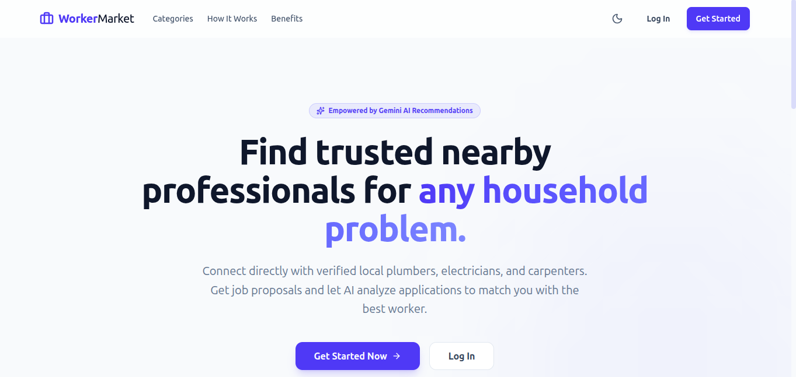
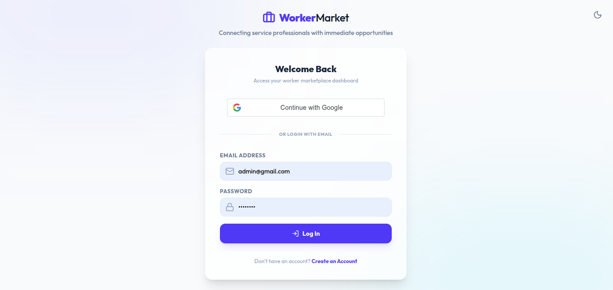
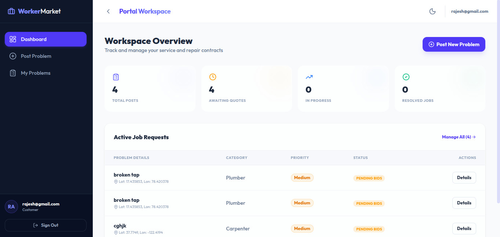
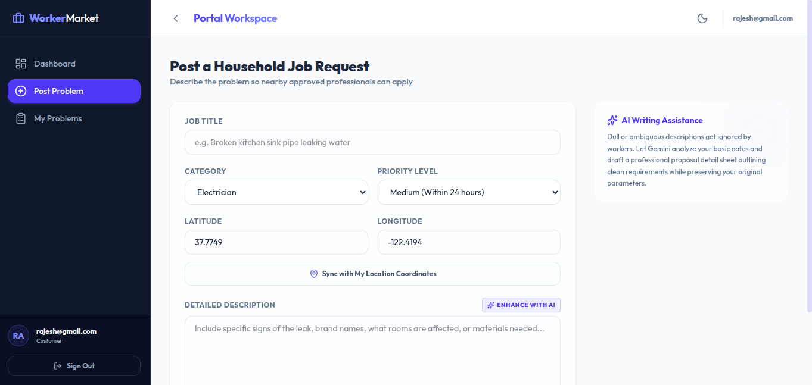
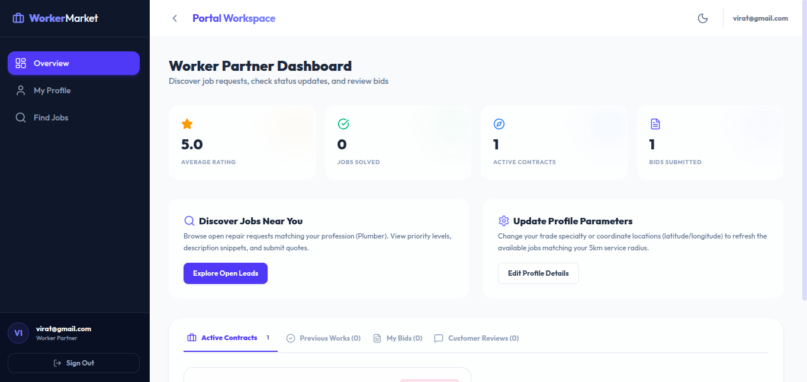
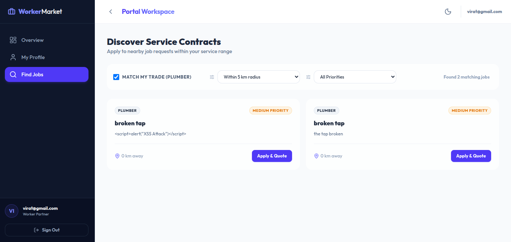

# 🚀 WorkerPlatform

A full-stack web application that connects users with skilled workers such as electricians, plumbers, carpenters, mechanics, and other service professionals.

The platform allows users to post service requests, workers to discover and apply for nearby jobs, and administrators to manage the entire platform. It also integrates **Google OAuth 2.0**, **JWT Authentication**, **Spring Security**, and **Google Gemini AI** for an enhanced user experience.

---

# 📸 Application Screenshots

## 🏠 Landing Page



---

## 🔐 Login Page



---

## 👤 Customer Dashboard



---

## ➕ Post Problem



---

## 👷 Worker Dashboard



---

## 🔍 Find Jobs



---

# ✨ Features

## 🔐 Authentication & Security

- JWT-based Stateless Authentication
- Google OAuth 2.0 Login
- Spring Security
- BCrypt Password Encryption
- Role-Based Access Control (RBAC)
- Protected REST APIs
- XSS Protection
- Security Headers
  - Content Security Policy (CSP)
  - X-Content-Type-Options
  - X-Frame-Options
  - Referrer Policy
- Input Validation

---

## 👤 User Features

- User Registration
- Google Sign-In
- Login using JWT
- Complete Profile after Google Sign-In
- Create Service Requests
- Track Posted Problems
- AI-enhanced Problem Description
- AI-based Worker Recommendation

---

## 👷 Worker Features

- Worker Registration
- Google Sign-In
- Worker Dashboard
- Browse Available Jobs
- Apply for Jobs
- Manage Worker Profile
- Email Notifications for Nearby Jobs

---

## 🛠️ Admin Features

- Manage Users
- Approve Workers
- View Worker Registrations
- Role-Based Dashboard Access

---

## 🤖 AI Features

Powered by **Google Gemini API**

- Enhance user problem descriptions
- Recommend suitable worker categories
- Improve service request quality

---

# 🏗️ Tech Stack

## Frontend

- React
- Vite
- React Router
- Context API
- Axios
- HTML5
- CSS3
- JavaScript (ES6)

## Backend

- Spring Boot
- Spring Security
- JWT Authentication
- Google OAuth 2.0
- Spring Validation
- Java Mail Sender

## Database

- MongoDB

## AI

- Google Gemini API

## Tools

- Git
- GitHub
- Maven
- Postman

---

# 🏛️ Project Architecture

```text
                 React Frontend
                        │
                        ▼
                  REST API Calls
                        │
                        ▼
          Spring Boot REST Controllers
                        │
                        ▼
                 Service Layer
                        │
        ┌───────────────┴───────────────┐
        ▼                               ▼
   MongoDB Database              Google Gemini AI
        │
        ▼
 Spring Security + JWT Authentication
```

---

# 🔑 Authentication Flow

## Email & Password Login

```text
User
   │
   ▼
Login
   │
   ▼
AuthenticationManager
   │
   ▼
UserDetailsService
   │
   ▼
Generate JWT
   │
   ▼
Protected APIs
```

---

## Google OAuth Login (Stateless)

```text
User
   │
Continue with Google
   │
Google Authentication
   │
Google ID Token
   │
Backend Verification
   │
Find/Create User
   │
Generate Application JWT
   │
Protected APIs
```

---

# 🔒 Security Features

- JWT Authentication
- Stateless Google OAuth 2.0
- Spring Security
- AuthTokenFilter
- BCrypt Password Encoding
- XSS Protection
- Content Security Policy (CSP)
- MIME Sniffing Protection
- Clickjacking Protection
- Referrer Policy
- Input Validation

---

# 📂 Project Structure

```text
WorkerPlatform
│
├── backend
│   ├── Controllers
│   ├── Service
│   ├── Repository
│   ├── Models
│   ├── Security
│   ├── Payload
│   └── Utils
│
├── frontend
│   ├── pages
│   ├── routes
│   ├── context
│   ├── layouts
│   ├── services
│   └── api
│
└── README.md
```

---

# 📌 REST API Modules

### Authentication

- User Registration
- User Login
- Google Login

### User

- Update Profile
- Create Problems
- View Problems

### Worker

- Worker Registration
- Worker Profile
- Nearby Jobs

### Problem

- Create Problem
- Get Problems
- Update Problem Status

### Applications

- Apply for Jobs
- View Applications

### Reviews

- Add Reviews
- View Reviews

### AI

- Enhance Description
- Worker Recommendation

---

# ⚙️ Installation

## Clone Repository

```bash
git clone https://github.com/akhila1402/WorkerPlatform.git
```

---

## Backend

```bash
cd backend
```

Configure your `application.properties`.

Run the backend

```bash
./mvnw spring-boot:run
```

---

## Frontend

```bash
cd frontend
npm install
npm run dev
```

---

# 🔧 Environment Variables

Configure the following in the backend:

- MongoDB URI
- JWT Secret
- JWT Expiration
- Gmail SMTP Credentials
- Google OAuth Client ID
- Google Gemini API Key

Configure the frontend using the `.env.example` file.

---

# 🚀 Future Enhancements

- Live Location Tracking
- Real-time Notifications
- Chat Between User & Worker
- Online Payments
- Image Upload Support
- Docker Deployment
- Kubernetes Deployment
- Analytics Dashboard
- Push Notifications

---

# 📚 Learning Outcomes

This project demonstrates practical implementation of:

- Spring Boot REST APIs
- React Application Development
- MongoDB Integration
- JWT Authentication
- Google OAuth 2.0
- Spring Security
- Role-Based Access Control
- Google Gemini AI Integration
- Secure REST API Development
- Modern Full Stack Architecture
